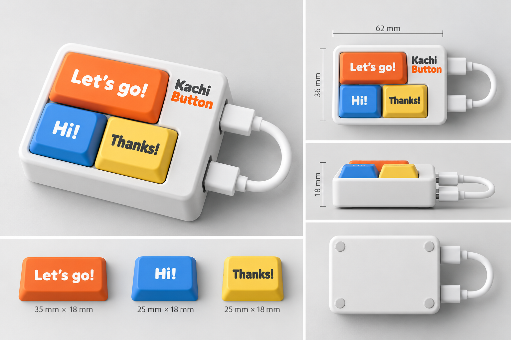
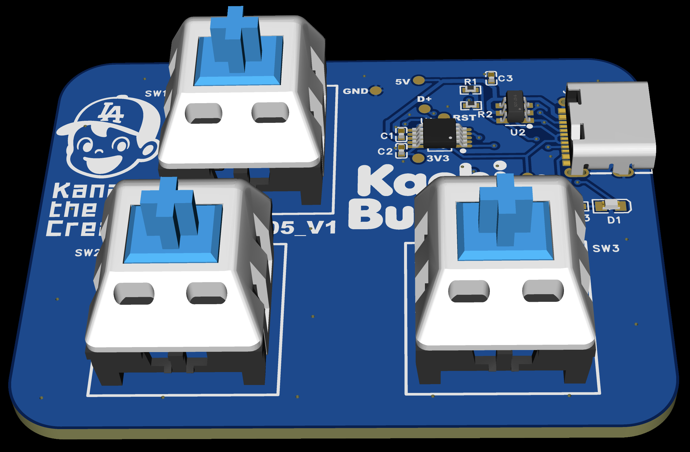

  

<strong>Click once. Type the whole thing.</strong>

Kachi Button is a tiny programmable USB keyboard designed to turn your favorite words and shortcuts into physical buttons. “Kachi” is the Japanese sound of a click.

The product concept combines three mechanical keys, a USB-C connection, and a compact enclosure. Use cases include quick game chat messages and recurring prompts such as “OK,” “Continue,” and “Do it.” The image above is a design reference, not a photograph of a validated production unit.

## Hardware v1

The first PCB uses a WCH CH552E, three MX-compatible switches, a USB-C connector, and a status LED. One large key sits above two smaller keys. The two-layer board has R5 corners and is intended for a snap-fit enclosure. All resistors and capacitors use 0402 packages.

See the [top and bottom board previews](pcb/v1/README.md#board-previews) for routing and silkscreen details.

Manufacturing exports are available in [pcb/v1](pcb/v1/README.md), including Gerber, BOM, pick-and-place, and STEP files. The design record explains the circuit, component choices, layout, and outstanding validation.

The [USB keyboard firmware](firmware/README.md) defaults to `Go Go!`, `Hi!`, and `Thx` on the upper, lower-left, and lower-right keys. A USB command-line tool can edit and save each key’s text, repeat count, and interval in milliseconds; host-initiated firmware upload is supported. See the [bring-up record](firmware/bring-up.md) for build and hardware verification. A browser-based configuration tool remains planned; enclosure fit and broader hardware validation remain separate checks.

## Development

See the [detailed specifications](docs/README.md) for product requirements, PCB dimensions and placement, firmware, and the enclosure to be designed in 3D CAD. The latest design decisions fix keycap sizes at 33 × 18 mm for the upper key and 25 × 18 mm for each lower key; enclosure dimensions remain provisional. The purchased USB-C cable is nominally 10 cm long.

For keyboard software, start with [firmware development](docs/firmware-development.md), the [feature inventory](docs/firmware-features.md), and [firmware internals](docs/firmware-internals.md). These describe the implemented CLI configuration and upload paths; the product specifications also include future requirements.

PCB and schematic work uses the EasyEDA MCP / `easyeda-api` skill workflow. See [PCB development with EasyEDA](docs/pcb-development.md) for connection setup, editing practices, verification, and export steps.

Chat with contributors in Japanese. Write documentation, code, code comments, issues, and pull requests in English, as specified in [AGENTS.md](AGENTS.md).
