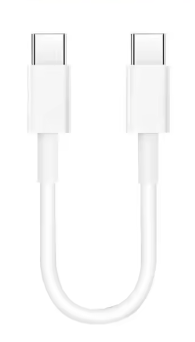

# Product Specification

Status: requirements baseline, September 6, 2026. See [the specification index](../README.md) for authority and unresolved decisions.

## Purpose and appearance

Kachi Button is a compact programmable USB keyboard that turns frequently used words and shortcuts into physical buttons. The mechanical click is part of the experience. “Kachi” refers to the sound of a click.

The core message is: **Click once. Type the whole thing.**

This is the latest appearance reference. It shows a rounded white enclosure, an orange upper key, blue and yellow lower keys, a logo beside the upper key, and a short cable loop on the right. Colors and printed legends are a presentation baseline; key mappings remain configurable.

The latest user decision supersedes the upper key width in this image: upper 33 × 18 mm and lower two each 25 × 18 mm. The pictured enclosure dimensions are provisional. See [the enclosure specification](enclosure-spec.md) for the resulting fit constraints.

Use the redesigned assets under `images/logo/` and the editable `images/kachi-button.sketch` source. The repository's main README uses `kachi-button-text-white-background.png` as its header logo. Preserve the existing PCB artwork separately from enclosure branding.

## Users and example actions

| Context | Example |
| --- | --- |
| Game chat | Send “Hi!”, “Thanks!”, or “Let's go!” after the user focuses the chat field |
| AI conversations | Send “OK”, “Continue.”, or “Yes, do it.” |
| Everyday shortcuts | Map a key, modifier shortcut, or short text to a physical button |
| Maker demonstration | Choose keycaps, configure phrases in the browser, and use them immediately |

The device types into the host's focused application. It does not detect the active application or automatically open a game chat field in the initial release. Sending Enter is an explicit mapping option, not an implicit suffix on every phrase.

## Required experience

1. Connect the device to a USB host with a data-capable cable.
2. The host recognizes a standard HID keyboard; normal typing does not require a companion application.
3. Open the configuration page in a supported desktop browser and select **Connect Kachi Button**.
4. Choose the device through the browser's permission UI.
5. Edit the mappings using physical labels **Top**, **Lower left**, and **Lower right**.
6. Save explicitly and show success only after the device confirms persistence.
7. Close the page. The device continues using its saved mappings while powered by the host.

“Standalone” means the browser is unnecessary after configuration. It does not mean battery-powered or able to type without a host. The product has no battery, charging circuit, Bluetooth, or Wi-Fi.

## Scope and milestones

| Milestone | Required outcome |
| --- | --- |
| Hardware bring-up | Verify power, programming, three inputs, LED polarity, and USB keyboard enumeration on v1 |
| Initial typing demonstration | One debounced press emits one fixed text action; no stuck modifiers or unintended startup typing |
| Configurable prototype | Composite keyboard/vendor HID, three persistent mappings, browser read/edit/save/reset flow |
| Mechanical prototype | Parametric CAD, printed enclosure, working snap fits, key travel, connector access, and cable parking |
| Product validation | Combined use on target hosts, power cycles, configuration failures, and repeated mechanical handling |

Initial configurable text targets 32 ASCII bytes per key using a US keyboard layout. The product roadmap also includes single keys, shortcuts, and text followed by Enter. Double presses, long presses, multi-step scripts, Unicode/emoji typing, wireless operation, and battery power are outside the initial scope. See [firmware requirements](firmware-spec.md) for staging and technical limits.

Windows, macOS, and Linux are keyboard compatibility targets. Android keyboard use is a later host/cable compatibility test, not a promise of Android WebHID support. Browser support and host permission requirements must be tested separately.

## Purchased cable

The user purchased a **nominal 10 cm USB-C male-to-USB-C male cable**, reported September 6, 2026. The supplied reference shows a white cable, straight male plugs with white molded bodies, and a flexible section bent into a U. This replaces the original 15–20 cm cable concept.

The image is a user-supplied appearance reference, not a dimensional drawing or an electrical datasheet. Manufacturer, SKU, whether the stated length includes the plugs, data capability, overmold dimensions, and bend radius are not yet verified.

USB 2.0 data operation is required. Confirm enumeration and typing with the purchased cable; a charge-only cable cannot satisfy the product requirement. Do not assume data support or a particular PD rating from the image.

During storage, one plug stays connected to J1 and the other parks in an unpowered holder on the enclosure to form a loop. The latest product image places both plug bodies on the right side. The second opening is a mechanical parking feature, not a second electrical USB port. Its final location depends on fitting the actual 10 cm cable without stressing the connector.

## Cost and validation

Use low-cost stocked parts, Top-side assembly, and standard PCB fabrication where possible. Recheck all part numbers, order-quantity pricing, and assembly inventory before purchasing. The earlier 30–50 prototype and 50–100 event-unit quantities are planning estimates, not purchase commitments.

A prototype is accepted only when it can connect, type once per press, save and retain mappings, fit its enclosure, and park/unpark the purchased cable without binding. Hardware exports and renderings alone do not satisfy these criteria.
